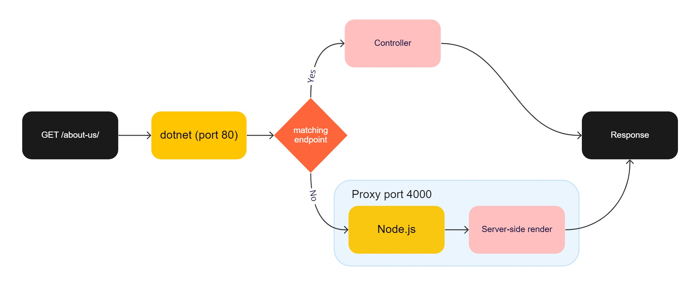

# Optimizely NextJS Headless Coupled architecture

This sample site demonstrates one approach to render Optimizely content with a JavaScript framework with server-side rendering, client side routing, working On-Page Edit (OPE) mode, and where the client app and backend are hosted in the same application. The client app is hosted in its own Node.js process and then proxied by dotnet. [See below for a more details](#architecture).

This sample uses [Next](https://nextjs.org/), but most of the techniques are framework agnostic and can be used with any other framework, such as Vue or Angular.

Content is fetched from Optimizely using the Content Delivery API: <https://world.optimizely.com/documentation/developer-guides/cms/content/content-delivery-api/>

## Prerequisites

This project uses:

-   Node.js 20+
-   .NET SDK 6+
-   SQL Server 2016 Express LocalDB ([download here](https://www.microsoft.com/en-us/sql-server/sql-server-downloads))

## Setup and Run

1. Run `scripts/setup.cmd` or `scripts/setup.sh` depending on your operating system. You can re-run the setup at any time to reset the backend with a fresh database.
2. Create `.env.local` and copy contents from `.env.example`.
3. Open terminal and run `dotnet run` or start it from Visual Studio.
    - Navigate to <http://localhost:8080>.
    - Create an admin user.
    - The Node.js proxy will automatically start the client app and dotnet will serve it when it's ready.

## Installation on Mac or Linux

- Download and install docker desktop: https://www.docker.com/get-started/
- Run docker to setup a local instance of Azure SQL Edge which is compatible with Optimizely by running the below command:
`docker compose up`

The settings in the `docker-compose.yml` file contains the password and ports configured for the SQL Server instance.

The `name` and `MSQL_SA_PASSWORD` can be anything you want.

To import a database to use either create an empty database and run Optimizelys command line tools to create new database or import the bacpac from:
`src/Valtech.Optimizely.Website/App_Data/optiheadless-coupled.bacpac`. To import the database you need to install Azure Data Studio as well as the extension `SQL Server dacpac extension`: https://learn.microsoft.com/en-us/azure-data-studio/extensions/sql-server-dacpac-extension

The project is prepared to use user secrets. Read more about them here:
https://learn.microsoft.com/en-us/aspnet/core/security/app-secrets

To set the connection string after setting up docker use the following command in the Website folder `src/Valtech.Optimizely.Website/`:
`dotnet user-secrets set "ConnectionStrings:EPiSeverDB" "Server=localhost;Database=NameOfyourDatabase;User=sa;Password=$howMeTheMon3y!"`

The user secrets override the appSettings.json file connection string in this case so you can leave it as is.

NB! The website does not start if these above changes are not done. The following error is shown when running the site: `System.PlatformNotSupportedException: LocalDB is not supported on this platform.`

## Architecture

### Backend

The backend is based on an [empty installation of Content Cloud](https://docs.developers.optimizely.com/content-cloud/v12.0.0-content-cloud/docs/installing-optimizely-net-5) with the [Delivery API](https://docs.developers.optimizely.com/content-cloud/v1.5.0-content-delivery-api/docs/quick-start) installed. Content types are defined with C# classes. What differs from a decoupled setup, is that the client app (Node.js) and backend (dotnet) are served on the same address by proxing requests from dotnet to the Node.js process.



In `startup.cs` a proxy is added by calling `services.AddNodeJs()` and by calling `app.UseEndpoints(e => e.MapNodeJs());` a fallback endpoint is registered to the Node.js process. This means if an incoming request doesn't match any other endpoint, for example a controller, the request will be proxied to the Node.js process. The Node.js process is managed automatically by the proxy, there's no need to start it manually.

### Client app

In `utils/getSSRContent.ts`, default configuration for the Content Delivery API SDK is set up. Routing is be based on file naming. The page component `src/app/[...slug]/page.tsx` is a wildcard route and all requests that don't map any other page component or route will end up here. It's this component that will call the Content Delivery API and try to route the request to a content page from the backend.

The content page, if resolved successfully, is rendered by the component `/components/BlockComponentSelector`. This component will resolve the best matching component from the `/components/pages` folder to render it. Then same component is used for rendering of content blocks. An example of this can be found in `/compontents/EpiserverContentArea.vue`, this component is used for rendering of content area properties.

#### Storybook

[Storybook](https://storybook.js.org/) is implemented and can be run `npm run storybook` and Storybook will open a browser pointing to <http://localhost:6006>

### Enable on-page-edit

The on-page-edit overlay is based on data attributes that are rendered on the content properties' HTML elements. These attributes are only needed when the content is rendered inside Edit mode.

## Publishing and Hosting

In `Valtech.Optimizely.Website.csproj` there is a target called `BuildClientApp`. This target is optional, but it makes publishing of the solution a bit more convenient. This target can be replaced by a separate build step in a CI/CD pipeline, if preferred. This means a regular `dotnet publish` will suffice.

To host this setup in DXP, follow the [regular deployment instructions](https://docs.developers.optimizely.com/digital-experience-platform/v1.2.0-dxp-cloud-services/docs/deploy-using-code-packages) and then enable Node.js with the [platform settings file](https://docs.developers.optimizely.com/digital-experience-platform/v1.2.0-dxp-cloud-services/docs/code-package-format#platform-settings-file):

```json
{
    "$schema": "https://schema.episerver.net/paasportal/2022-03-24/platformschema.json",
    "platformPackages": [
        {
            "name": "NodeJs",
            "version": 20
        }
    ]
}
```
